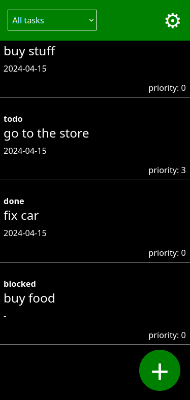
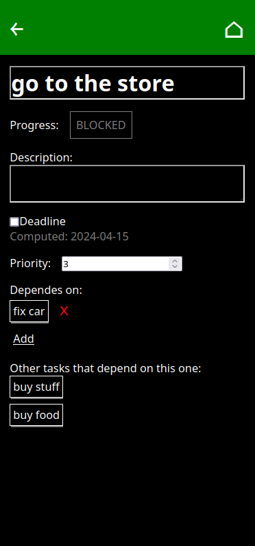
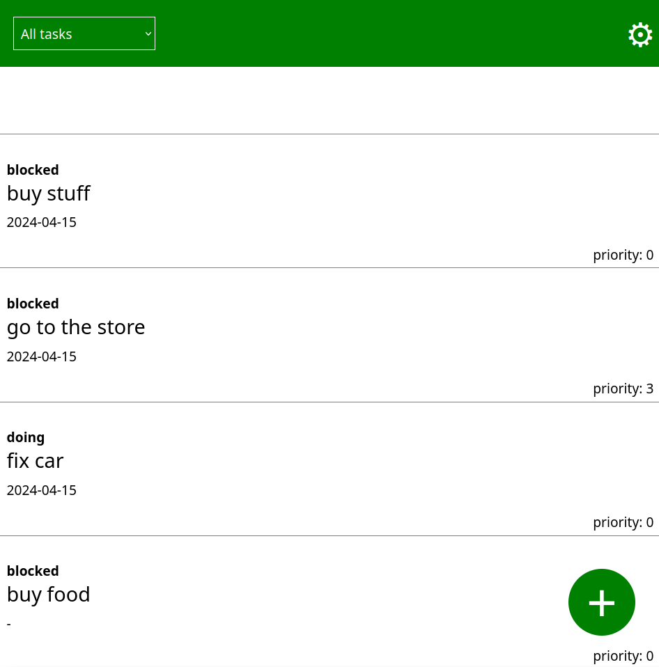

# TaskGraph

TODO-app with dependency management. 

## Features: 
  * Every task can have any number of other tasks as dependencies.
  * A task can only be started when all of its dependencies are marked DONE.
  * Every task "inherits" the highest priority and closest deadline of all the tasks that depend on it. 
  * Apart from DONE a task can also be marked FAILED. 
    If a task failes then all that tasks that depend on it automatically become FAILED, too. 
  * Agenda view: a topological sort of all tasks. This means that all tasks are ordered by deadline and priority 
    but in such a way that a task never comes before any of its dependencies. 
    
## Coming soon
  * Export/import all tasks as a simple JSON file. 
  * Recurring tasks
  * Graphical representation of the relations between tasks

